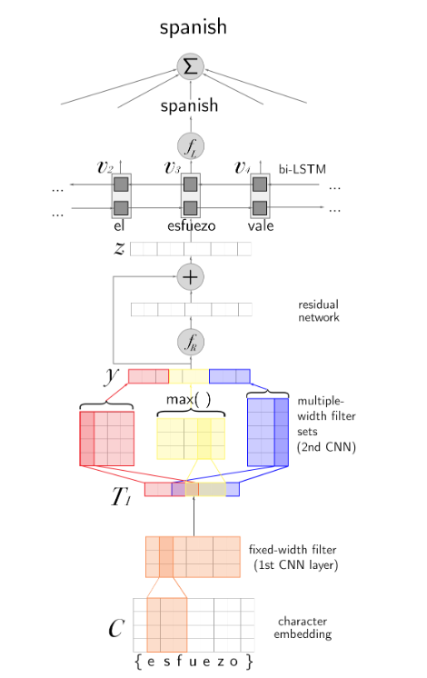
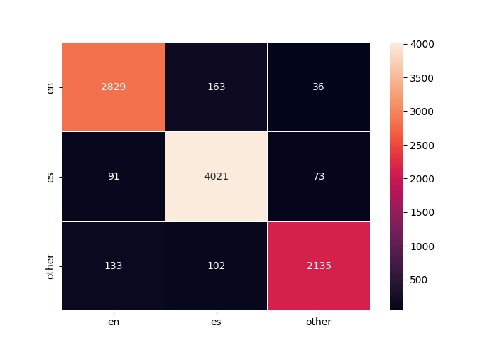

# PyTorch-Detect-Code-Switching

## Task Description
Currently, the research in NLP has been focusing on dealing with types of multilingual content. Thus, the first thing that we need to learn for working on different NLP tasks, such as Question Answering, is to identify the languages accurately on texts. This repository uses the idea behind the paper [A Neural Model for Language Identification in Code-Switched Tweets](https://homes.cs.washington.edu/~nasmith/papers/jaech+mulcaire+hathi+ostendorf+smith.lics16.pdf).

## Data

http://www.care4lang.seas.gwu.edu/cs2/call.html

This data is a collection of tweets; in particular,three files for the training set and three for the validation set:


* `offsets_mod.tsv`:
```
tweet_id, user_id, start, end, gold label
```

* `tweets.tsv`:
```
tweet_id, user_id, tweet text
```

* `data.tsv`:
```
tweet_id, user_id, start, end, token, gold label
```

The gold labels can be one of three:

* en
* es
* other

### Data Analysis

* As it can be seen in the following table, data are imbalanced in both the training and test set. While the number of `English` tokens in training data is about 50%, the number of `Spanish` tokens prevails in the test set.

    | label | train | dev |
    | --- | --- | --- |
    | `en` | **46042** | 3028 |
    | `es` | 25563 | **4185** |
    | `other` | 20257 | 2370 |
    | sum | 91862 | 9583 |

* The number of tweets in the training set is `7400` and in the test set is `832`. The tweets in both sets are wholly from two disjoint groups. The training set includes tweets of 6 persons and the test set has 8 persons' tweets.

    | user id | train | dev |
    | :---: | :---: | :---: |
    | 1 | 1160520883 | 156036283 |
    | 2 | 1520815188 | 21327323 |
    | 3 | 1651154684 | 270181505 |
    | 4 | 169403434 | 28261811 |
    | 5 | 304724626 | 364263613 |
    | 6 | 336199483 | 382890691 |
    | 7 |  | 418322879 |
    | 8 |  | 76523773 |
* distribution of unique tokens and characters.
    | | unique token | unique token (lower case) | unique characters |
    | :---: | :---: | :---: | :---: |
    | train | 14366 | 12220 | 50 |
    | dev | 2771 | 2559 | 28
* The distribution of the length of the tokens are depicted below which are taken by the following linux command:
    ```bash
    cut -f5 train_data.tsv|awk '{print length}'|sort -n |uniq -c|awk -F" " '{print $NF" " $(NF-1)}'|R --slave -e 'x <- scan(file="stdin", quiet=TRUE,  what=list(numeric(), numeric())); png("Histogram of tokens length-train.png");plot(x[[1]],x[[2]], xlab="length", ylab="frequency", main="Train");'
    ```
    
    

    It is evident that both data sets have the same distribution of tokens' lengths with a slight shift. There are several outliers in both datasets as users tend to repeat the characters on social media. The weighted average tokens' lengths for the training and test sets are `3.93` and `4.11`, respectively. I've used the following to compute these numbers:
    ```bash
    cut -f5 ../data/train_data.tsv|awk '{print length}'|sort -n |uniq -c|awk -F" " '{print $NF" " $(NF-1)}'|tr " " "*"|paste -sd+|bc -l
    ```

### Preprocssing
* Some rows in `[train|dev]_data.csv` include `"` resulting weird issue with `pandas.read_csv`. Actually, it reads the next lines till reaches another `"`, so I set `quotechar` option to `'\0'`(=NULL) in `pandas.read_csv` to solve this issue.
* I've also checked the availability of the Null in those files with the following command:
    ```bash
    grep -Pa '\x00' data/train_data.tsv
    grep -Pa '\x00' data/dev_data.tsv
    ```
* Another solution to the previous issue is the `quoting` option with `3` as its value which means `QUOTE_NONE`.
* As it is mentioned in the paper, the data contains many long and repetitive character sequences such as “hahahaha...”. To deal with these, we restricted any sequence of repeating characters to at most five repetitions with a maximum length of 20 for each token.
    ```python
    df['token'] = df['token'].apply(lambda t: re.sub(r'(.)\1{4,}',r'\1\1\1\1', t)[:20])
    ```

## Installing dependencies

You can use the `pip` program to install the dependencies on your own. They are all listed in the `requirements.txt` file.

To use this method, you would proceed as:

```pip install -r requirements.txt```

## Model Architecture

```python
BiLSTMtagger(
  (word_embeddings): Char2Vec(
    (embeds): Embedding(300, 9, padding_idx=0)
    (conv1): Sequential(
      (0): Conv1d(9, 21, kernel_size=(3,), stride=(1,))
      (1): ReLU()
      (2): Dropout(p=0.1, inplace=False)
    )
    (convs2): ModuleList(
      (0): Sequential(
        (0): Conv1d(21, 5, kernel_size=(3,), stride=(1,))
        (1): ReLU()
      )
      (1): Sequential(
        (0): Conv1d(21, 5, kernel_size=(4,), stride=(1,))
        (1): ReLU()
      )
      (2): Sequential(
        (0): Conv1d(21, 5, kernel_size=(5,), stride=(1,))
        (1): ReLU()
      )
    )
    (linear): Sequential(
      (0): Linear(in_features=15, out_features=15, bias=True)
      (1): ReLU()
    )
  )
  (lstm): LSTM(15, 128, num_layers=2, batch_first=True, dropout=0.3, bidirectional=True)
  (hidden2tag): Linear(in_features=256, out_features=4, bias=True)
)
```
#### Model Summary
```bash
=================================================================
Layer (type:depth-idx)                   Param #
=================================================================
├─Char2Vec: 1-1                          --
|    └─Embedding: 2-1                    2,700
|    └─Sequential: 2-2                   --
|    |    └─Conv1d: 3-1                  588
|    |    └─ReLU: 3-2                    --
|    |    └─Dropout: 3-3                 --
|    └─ModuleList: 2-3                   --
|    |    └─Sequential: 3-4              320
|    |    └─Sequential: 3-5              425
|    |    └─Sequential: 3-6              530
|    └─Sequential: 2-4                   --
|    |    └─Linear: 3-7                  240
|    |    └─ReLU: 3-8                    --
├─LSTM: 1-2                              543,744
├─Linear: 1-3                            1,028
=================================================================
Total params: 549,575
Trainable params: 549,575
Non-trainable params: 0
=================================================================
```

## How to use the code

### Training

Just run `train.py` from `code` directory. It assumes that the `cwd` is in the `code` directory.

### Prediction

Launch `predict.py` with the following arguments:

- `model`: path of the pre-trained model
- `text`: input text

Example usage:
```bash
python predict.py --model pretrained_model.pth --text="@lililium This is an audio book !"
```

# Result

 Running the model on the Google Colab with `Tesla T4 GPU` and 100 epochs, achieved the `validation f1-score` of `0.92`.

 

### classification Report

```bash
              precision    recall  f1-score   support

          en       0.93      0.93      0.93      3028
          es       0.94      0.96      0.95      4185
       other       0.95      0.90      0.93      2370

    accuracy                           0.94      9583
   macro avg       0.94      0.93      0.94      9583
weighted avg       0.94      0.94      0.94      9583
```

### Confusion Matrix


## TODO
 - [ ] Data augmentation
 - [ ] Fine tunning the model to find the best hyper-parameters
